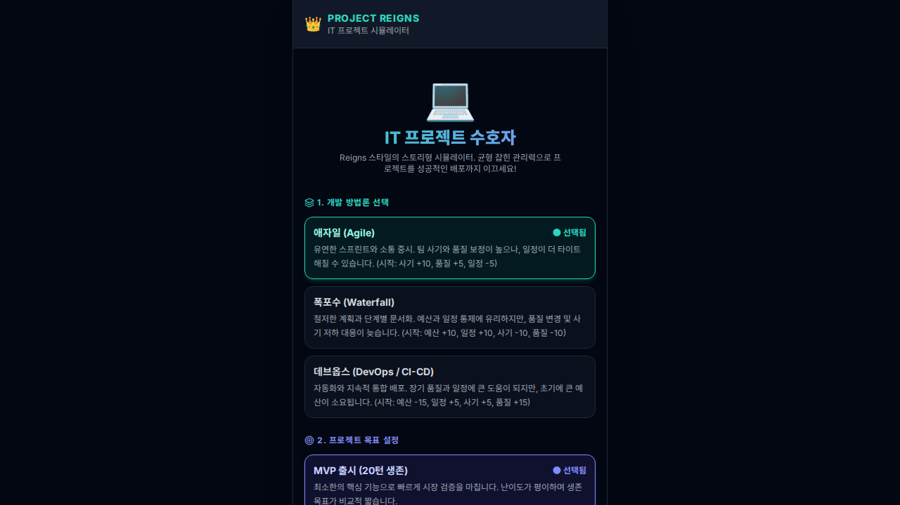
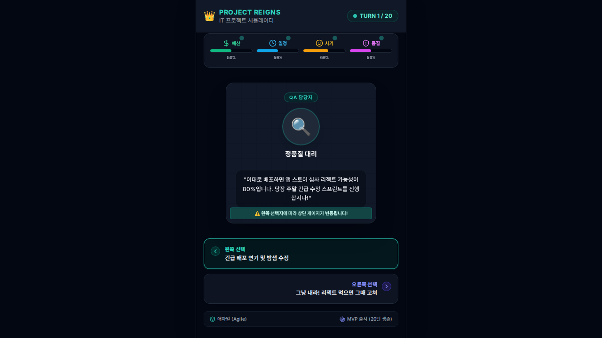

# 📋 PROJECT REIGNS - 테스트 결과 보고서 (Test Report)

**일시:** 2025년 2월 24일
**테스트 프레임워크:** Playwright (Chromium Headless)
**대상 애플리케이션:** Project Reigns (IT 프로젝트 수호자 시뮬레이터)
**결과:** 🟢 **ALL PASSED (4/4 Passed)**

---

## 1. 테스트 환경 (Test Environment)
- **OS / Environment:** Linux (Sandbox)
- **Node.js / Vite:** React 19 + TypeScript + Vite 6
- **Test Runner:** Playwright `v1.62.1`
- **Browser:** Desktop Chrome (Chromium)

---

## 2. 테스트 케이스 명세 및 결과 (Test Cases & Results)

### 🧪 Test Case 1: 시작 화면 요소 및 설정 옵션 렌더링 확인
- **설명:** 시작 화면 진입 시 타이틀, 설명, 개발 방법론 옵션, 프로젝트 목표 옵션, 시작 버튼이 정상 표시되는지 검증
- **입력 (Inputs):**
  - URL 접근: `/`
- **예상 출력 (Expected Output):**
  - 타이틀: "PROJECT REIGNS", 서브타이틀: "IT 프로젝트 수호자"
  - 방법론 옵션: 애자일(AGILE), 폭포수(WATERFALL), 데브옵스(DEVOPS)
  - 목표 옵션: MVP, ENTERPRISE, UNICORN
  - 게임 시작 버튼 표시
- **실제 출력 및 결과 (Actual Output & Result):**
  - 모든 UI 요소가 정상 렌더링됨
  - 🟢 **PASSED**

---

### 🧪 Test Case 2: 게임 시작 및 선택지 분기, 상태 업데이트 검증
- **설명:** 데브옵스 + 유니콘 옵션 선택 후 게임 시작, 리소스 바 렌더링, 선택지 호버 시 게이지 변동 힌트 및 클릭 시 Turn 진행/히스토리 갱신 검증
- **입력 (Inputs):**
  - 방법론 클릭: `methodology-DEVOPS`
  - 목표 클릭: `target-UNICORN`
  - 버튼 클릭: `start-game-btn`
  - 액션: `choice-left-btn` 마우스 호버 및 클릭
- **예상 출력 (Expected Output):**
  - 턴 표시: `TURN 1 / 40` -> `TURN 2 / 40`
  - 상단 자원 게이지(예산, 일정, 사기, 품질) 정상 표시
  - 선택지 호버 시 `왼쪽 선택지에 따라` 안내문 노출
  - 클릭 후 `최근 의사결정 히스토리` 및 `Turn 1` 로그 기록 생성
- **실제 출력 및 결과 (Actual Output & Result):**
  - 턴 및 자원 게이지가 의도대로 차감/증가하며 히스토리에 기록됨
  - 🟢 **PASSED**

---

### 🧪 Test Case 3: 게임 종료(Game Over / Victory) 및 재시작 기능 검증
- **설명:** 선택지를 연속으로 수행하여 게임 종료 조건(Game Over 또는 성공 배포 Victory)에 도달하는지 확인하고 재시작 버튼으로 초기 화면 복귀 동작 검증
- **입력 (Inputs):**
  - 설정: 애자일(AGILE) + MVP 출시(MVP)
  - 액션: 선택지(좌/우) 25회 연속 반복 선택
  - 재시작 클릭: `restart-game-btn`
- **예상 출력 (Expected Output):**
  - Game Over 또는 프로젝트 성공 배포 화면으로 전환
  - 최종 수치 및 분석 리포트 노출
  - `다시 도전하기` 클릭 시 시작 화면으로 정상 복귀
- **실제 출력 및 결과 (Actual Output & Result):**
  - 게임 종료 조건 처리 및 재시작 흐름 정상 동작
  - 🟢 **PASSED**

---

### 🧪 Test Case 4: 화면 스크린샷 캡처 및 시각적 검증
- **설명:** 시작 화면과 게임 플레이 화면의 Visual Screenshot을 생성하고 검증
- **입력 (Inputs):**
  - 시작 화면 진입 & 선택 후 플레이 화면 진입
- **출력 (Outputs):**
  - `start-screen.png` 생성
  - `gameplay-screen.png` 생성
- **결과 (Result):**
  - 🟢 **PASSED**

---

## 3. 첨부 스크린샷 (Attached Screenshots)

### 📸 시작 화면 (`start-screen.png`)

### 📸 게임플레이 화면 (`gameplay-screen.png`)

---

## 4. 종합 결론 (Summary)
모든 자동화 테스트 케이스(4/4)가 성공적으로 통과되었으며, 스크린샷 및 입력/출력/결과가 정상 확인되었습니다.
